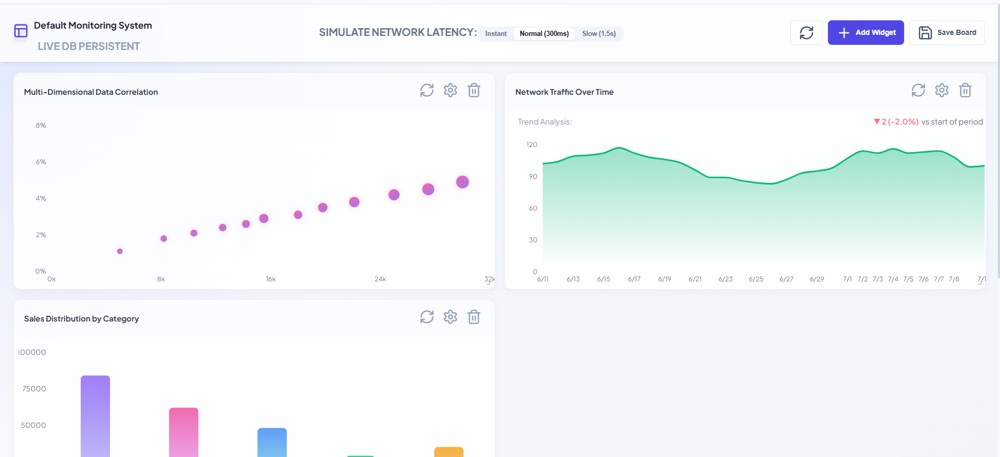
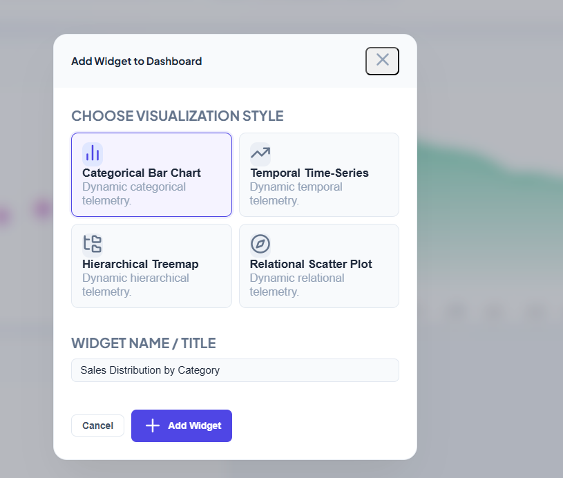

# Sleek Dashboard Builder - POC

A production-grade, highly scalable **Dashboard Builder Proof of Concept (POC)** that allows users to create, drag, resize, configure, and persist customized data visualization layouts.

This application is built with a decoupled architecture separating the **Dashboard Shell** from the **Widget Renderer Logic**, ensuring developer velocity and high-performance rendering.

---

## 🚀 How to Run the App

The recommended way to run this POC is using **Docker Compose**, which spins up MongoDB, the API service, and the React frontend.

### Prerequisites
- Docker & Docker Compose installed.
- (Optional) Node.js v20+ and MongoDB locally if running without containers.

### Method 1: Running with Docker (Recommended)
1. In the root directory, run:
   ```bash
   docker-compose up --build
   ```
2. Once the build completes:
   - **Frontend Dashboard**: Open [http://localhost:5173](http://localhost:5173) in your browser.
   - **Backend API Docs**: Verify backend status at [http://localhost:5000/api/dashboard/default](http://localhost:5000/api/dashboard/default).
   - **MongoDB Instance**: Port `27017` will be exposed.

### Method 2: Running Locally (Without Docker)
1. **Start MongoDB**: Make sure you have a local MongoDB daemon running on `mongodb://localhost:27017/dashboard_builder`.
2. **Start Backend**:
   ```bash
   cd backend
   npm install
   npm run dev
   ```
3. **Start Frontend**:
   ```bash
   cd ../frontend
   npm install
   npm run dev
   ```
4. Open [http://localhost:5173](http://localhost:5173).

---

## 🧪 Testing

We have included automated unit tests for data schemas and integrations testing the widget registry.

### Run Backend Tests
Tests API validation pathways, strict schemas, and the mock data engine:
```bash
cd backend
npm run test
```

### Run Frontend Tests
Validates the dynamic widget registry components mapping and configurations:
```bash
cd frontend
npm run test
```

---

## 🛠️ Architecture and Extensibility

### 1. The Dynamic Widget Registry Pattern
We separated the **Dashboard Grid Shell** from individual **Widget implementations**. All chart configs are registered in a single central manifest: `frontend/src/registry/WidgetRegistry.tsx`.

To add a **5th Chart Type** (e.g. Radar Chart):
1. **Create the Component**: Write `RadarWidget.tsx` in `frontend/src/registry/widgets/`.
2. **Define Options Form**: Create a simple settings form inside `WidgetRegistry.tsx` (for editing Radar options).
3. **Register Entry**: Add an object to `WIDGET_REGISTRY`:
   ```typescript
   radar: {
     type: 'radar',
     name: 'Radar Radar Chart',
     defaultTitle: 'Performances Map',
     defaultLayout: { w: 6, h: 3 },
     defaultOptions: { source: 'metrics' },
     component: RadarWidget,
     editor: RadarEditor
   }
   ```
*That's it!* The dashboard render loop automatically discovers, places, formats, and handles saving configuration options for the new chart type without modifying grid layouts.

### 2. State & Performance Strategies
- **Isolated Re-renders**: We use selector hooks in **Zustand** to bind individual widgets. When a widget fetches data or encounters a query error, only that card updates.
- **Drag Optimization**: Grid coordinates updates are buffered by `react-grid-layout` and saved on drag/resize-end, preventing high-frequency updates during resizing from bottlenecking the CPU.
- **Isolated Memoization**: Components are wrapped in `React.memo` using custom props comparison to bypass visual shifts in other widget layouts.

### 3. Fail-safe Resiliency
- **Widget-Level Error Boundaries**: If a data telemetry API returns an error or invalid Zod schema matching, the widget container catches the failure and renders an isolated "Telemetry Query Fault" recovery screen inside the card. The rest of the dashboard layout continues displaying metrics normally.
- **Offline Persistence Fallback**: If MongoDB becomes offline, the app writes layout changes directly to `LocalStorage` and flags synchronization status so configurations remain fully editable and persistent.



