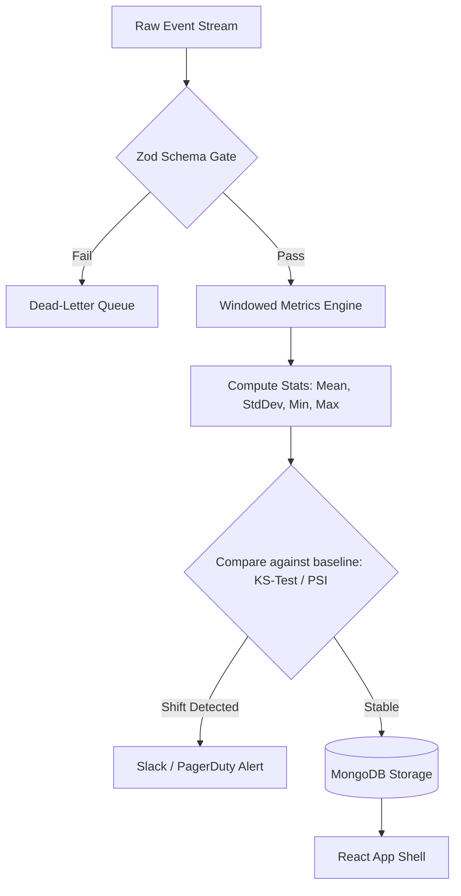

# Data Drift in Live Streaming Dashboards

This document outlines how to handle **Data Drift** if this Dashboard Builder were connected to a live, high-throughput production data stream.

---

## 1. Understanding Data Drift Types

When visualization metrics are fed by streaming real-time pipelines, the incoming data can degrade in three ways:

| Drift Type | Definition | Dashboard Impact |
| :--- | :--- | :--- |
| **Schema Drift** | The structure, type definition, or key mappings of telemetry change. | App crashes, blank widget widgets, or JSON parsing exceptions. |
| **Covariate (Feature) Shift** | The statistical distribution of the input variables changes over time. | Visual spikes, charts compressed to the edge of the scale, unreadable density. |
| **Concept Drift** | The semantic meaning of the metric itself changes. | Correct graphs displaying metrics that lead to wrong business decisions. |

---

## 2. Mitigation Strategies for our Architecture

To ensure our dashboard POC handles data drift in production, we would implement the following layers:

### A. Run-time Schema Gatekeeping (Schema Drift)
Our use of **Zod** on the backend represents the first line of defense. 
- In production, we would deploy a lightweight **Schema Validation Middleware** on raw stream consumer workers (e.g. consuming Kafka/Kinesis).
- Ingested metrics that fail schema parses are redirected to a **Dead-Letter Queue (DLQ)** for inspection, while the dashboard is served the last known valid database state. This prevents malformed logs from breaking widgets.

### B. Dynamic Axis Autoscaling (Covariate Shift)
If scatter plot variables (Relational) or network metrics (Temporal) shift by orders of magnitude (e.g., ad spends increasing 100x during Black Friday), hardcoded axis coordinates would clip or compress the points.
- **Solution**: We configure Recharts coordinate bounds using `domain={['auto', 'auto']}` and `allowDataOverflow={false}`. The chart dynamically recalibrates its min/max ticks in response to windowed streaming metrics.

### C. Moving-Window Outlier Rejection
In streaming charts, single-point network spikes (e.g. a momentary traffic jump from 100 to 1,000,000 requests) will flatten the rest of the time-series curve to a flat line.
- **Solution**: Implement a windowed median filter or running standard deviation check. Points that lie outside $+/- 4\sigma$ from the moving average are flagged as anomalies and can be optionally toggled off or colored differently in the visualization container.

---

## 3. Real-time Monitoring & Alerting Pipeline

To monitor drift proactively, the production backend architecture would deploy a validation flow:

### 4. Mathematical Drift Tracking (Advanced)
For numerical variables, we compute statistical checks inside a rolling 1-hour window:
1. **Population Stability Index (PSI)**: Measures how much a variable's distribution has shifted from a reference baseline. A PSI > 0.25 triggers a drift warning.
2. **Kolmogorov-Smirnov (KS) Test**: A non-parametric test comparing the cumulative distribution functions of the baseline data vs. the current sliding window. If the p-value is below 0.05, we flag a significant statistical distribution shift.
3. **Data Freshness / Latency Alerts**: Tracks `(IngestionTime - EventTime)`. If latency exceeds a set threshold, the dashboard updates a widget warning icon to signal stale data.
